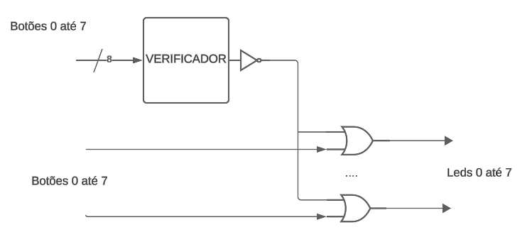

# Plano da máquina de café
Entrada: 8 switches, do 0 ao 7 representando os botões
Saída: Leds do 0 ao 7 representando qual botão foi apertado
Nota: Todos os leds serão ligados caso mais de um botão seja ligado ao mesmo tempo, representando uma entrada inválida.

## Diagrama
Há um componente verificador responsável por indicar se uma entrada é válida ou não.
Para cada led, ele será aceso se a entrada é inválida ou se o botão correspondente a ele foi pressionado.

## Tabela verdade

### Verificador 

| entrada | saída |
|---------|-------|
|entrada possui no máximo um bit ativo| 1 |
|caso contrário | 0 |

### Máquina de café
| entrada | saída |
|---------|-------|
|entrada possui no máximo um bit ativo| saída é igual à entrada |
|caso contrário | todos 1 |