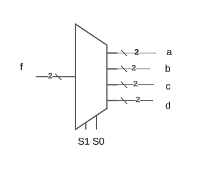

# Plano DEMUX

Entrada: SW1 até SW0 é o seletor, SW4 até SW3 é o dado
Saída: Leds 0 até 7, cada grupo de dois leds representa uma saída de 2 bits.

- LEDS 7 e 6 -> a
- LEDS 5 e 4 -> b

e assim por diante...

# Diagrama

# Tabela verdade

|entrada| a | b | c | d |
|--|--|--|--|--|
|00|f|00|00|00|
|01|00|f|00|00|
|10|00|00|f|00|
|11|00|00|00|f|